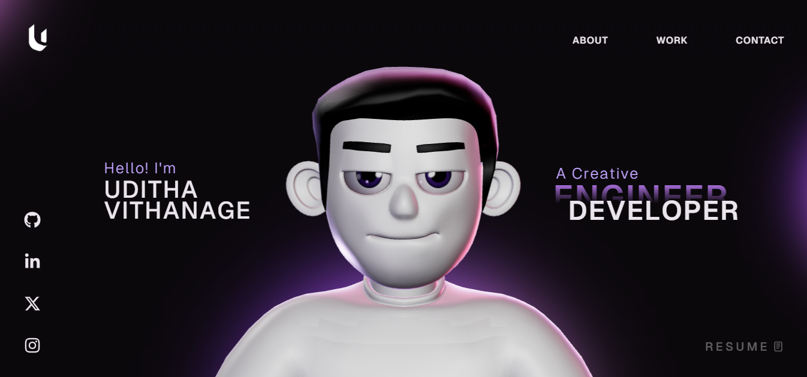

# Naveen R — 3D Interactive Portfolio

An immersive, interactive 3D portfolio built from scratch — featuring real-time physics, scroll-driven cinematics, and a fully animated character model.



## ✦ Overview

This portfolio is a ground-up experiment in pushing what a personal website can be. Instead of a flat page, the entire experience is rendered in 3D — a character moves, physics objects react, and the camera follows a cinematic scroll path. Every section is crafted to feel alive, not just informative.

### Sections

- **Landing** — Cinematic 3D intro with animated character model and particle effects
- **About** — Who I am: AI/ML engineering background, problem-solving philosophy
- **What I Do** — Two core competencies: BUILD (optimization engines) and ANALYZE (Bayesian/statistical methods)
- **Career Timeline** — Educational arc from self-taught fundamentals to B.Tech AI/ML
- **Projects** — Timetable Generator, Churn Analysis Pipeline, Bayesian Lung Cancer Risk Model
- **Tech Stack** — Interactive 3D physics sandbox showcasing the toolkit
- **Contact** — Direct links: email, GitHub, LinkedIn

## ✦ Architecture

```
src/
├── components/
│   ├── Character/        # 3D character model + animation controller
│   ├── Landing.tsx        # Hero section with 3D scene
│   ├── About.tsx          # Bio section
│   ├── WhatIDo.tsx        # Skills cards
│   ├── Career.tsx         # Timeline
│   ├── Work.tsx           # Project showcase
│   ├── TechStack.tsx      # Physics-based tech visualization
│   ├── Contact.tsx        # Footer + contact info
│   ├── Navbar.tsx         # Navigation
│   └── styles/            # Component-level CSS
├── App.tsx                # Root layout + scroll orchestration
├── index.css              # Global styles + design tokens
└── main.tsx               # Entry point
```

## ✦ Tech Stack

| Layer | Technology |
|-------|-----------|
| UI Framework | React 18 + TypeScript |
| 3D Engine | Three.js + React Three Fiber |
| Physics | React Three Rapier |
| Animation | GSAP + ScrollSmoother |
| Post-Processing | React Three Postprocessing |
| Build Tool | Vite 5 |

## ✦ Getting Started

```bash
# Install dependencies
npm install

# Start development server
npm run dev

# Production build
npm run build
```

## ✦ Key Design Decisions

- **Scroll-driven camera** — GSAP ScrollSmoother controls 3D camera position, creating a cinematic walkthrough rather than traditional scrolling
- **Physics sandbox** — Tech stack section uses Rapier physics engine so icons tumble and collide in real-time
- **Character animation** — GLB model with skeletal animation synced to scroll position
- **Performance-first** — Selective post-processing, frustum culling, and LOD management to maintain 60fps

## ✦ License

MIT — See [LICENSE](./LICENSE) for details.

---

Built by **Naveen R** — [GitHub](https://github.com/nav-in27) · [LinkedIn](https://linkedin.com/in/naveen-r-19a160326)
